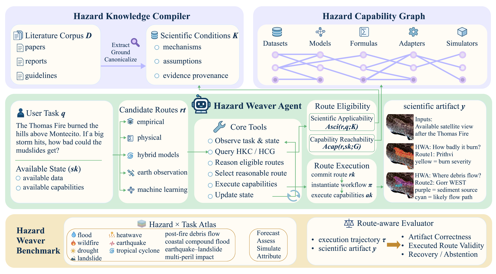
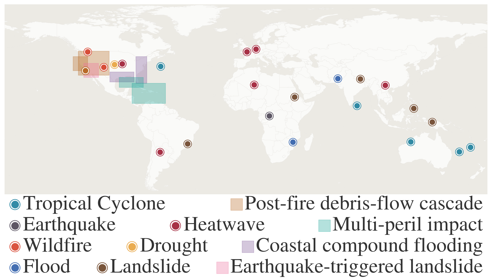

# HazardWeaver

**State-dependent scientific route selection for hazard-analysis agents.**

HazardWeaver is a framework for selecting and revising model-backed scientific workflows as an analysis evolves. Given a single- or multi-hazard task and the current analysis state, it grounds route applicability in scientific evidence, composes heterogeneous models and tools through typed capability relations, and selects, executes, and revises eligible routes as evidence and execution conditions change. This repository provides the HazardWeaver implementation, the sealed 141-instance Hazard Weaver Benchmark (HWB), the unified Decision-Constrained Accuracy (DCA) evaluator, and scripts for reproducing the paper’s results.




## Setup

```bash
python3 -m venv .venv && source .venv/bin/activate
pip install -e ".[dev]"
```

Set `PYTHON` if needed, e.g. `export PYTHON=.venv/bin/python`.

## Verify and reproduce paper numbers

```bash
make verify PYTHON=$PYTHON
make reproduce-paper PYTHON=$PYTHON
```

Optional checks:

```bash
make smoke PYTHON=$PYTHON
make evaluate-released PYTHON=$PYTHON
python scripts/check_public_paths.py
pytest tests -q
```

- **`make smoke`** — loads a small public taskpack, runs the leakage audit (solver view must not see sealed fields), and checks core imports. No GPU.
- **`make evaluate-released`** — reads the released per-instance JSONL and checks that headline Llama DCA still matches `released_results/` (expected **k = 126**).

## Layout

| Directory | Contents |
|-----------|----------|
| `src/hazardweaver/` | HKC, HCG, HWA, HWB, baselines |
| `benchmark/public/` | Manifest, solver taskpacks (sealed inventory) |
| `benchmark/sealed_eval/` | Evaluator contracts (post-submission scoring only) |
| `released_results/` | JSON/JSONL used in the paper |
| `paper_artifacts/` | Figures, LaTeX/table sources, manifest |

### Release overview

This release makes scientific route selection inspectable and reproducible from evidence grounding to final evaluation. It provides the complete HazardWeaver decision layer, a sealed benchmark of model-backed hazard workflows, and paper-aligned artifacts that can be verified without rerunning expensive language-model experiments.

**End-to-end HazardWeaver.** The released system connects three complementary mechanisms: HKC grounds route applicability in scientific evidence, HCG represents executable models and tools through typed capability relations, and HWA selects, executes, and revises eligible workflows as the analysis state changes. The implementation exposes the same capability interface used by the submitted baselines, enabling controlled comparisons of route-selection strategies.

**A benchmark for scientific route decisions.** HWB contains **141 sealed instances across 11 hazard tracks**, including **90 single-hazard** and **51 multi-hazard** tasks. Its **45 one-route** and **96 route-choice** instances test both reliable execution and selection among competing model-backed workflows. Each task cleanly separates the public solver context—task evidence, route descriptions, and capability interfaces—from the sealed evaluator contracts used after route commitment.

**Paper-complete evaluation.** The repository includes the unified DCA evaluator, all submitted adapted baselines and shared-tool controls, per-instance result records, and the exact inputs used to produce the paper’s tables and figures. Reviewers can verify benchmark integrity, replay evaluation, and regenerate the reported artifacts without model access; optional configurations support subset and full agent reruns.

**Portable scientific assets.** Lightweight fixture taskpacks provide CPU-only end-to-end tests, while acquisition scripts and documented mount points connect the release to the public scientific products and model weights used in the full experiments. Dataset provenance and preparation are documented in [docs/benchmark.md](docs/benchmark.md), with complete reproduction workflows in [docs/reproduction.md](docs/reproduction.md).

*Figure 1 — Global coverage of HWB.*



## License

MIT ([LICENSE](LICENSE)). For anonymous review, `configs/release.yaml` uses a placeholder copyright; use `configs/release_lab.yaml` when publishing under your lab name.
